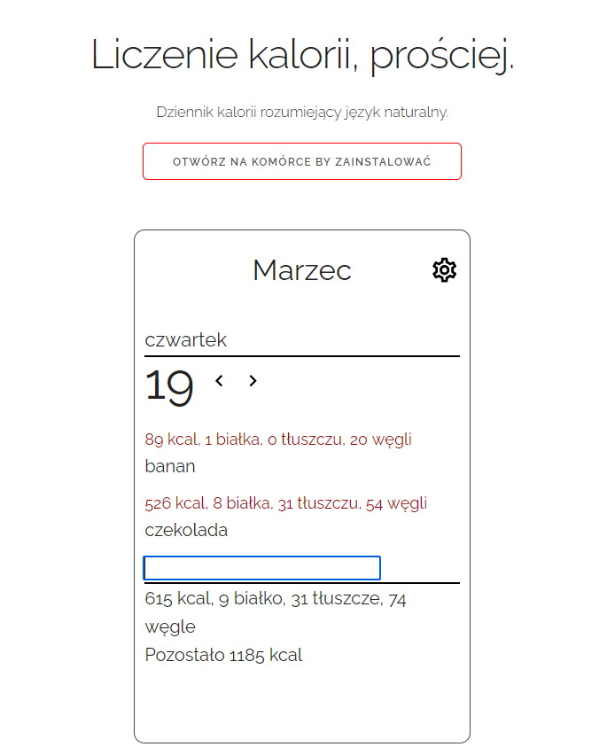

# calories - jużniemoge.pl
Progressive Web App
Prototype calories counter app that understands natural language. (Only in Polish)

[Web demo](https://calories.now.sh)
<p align="center">
      
<p align="center">

## Examples
Examples of what app understands:
```
2 tuziny jajek
1/2 łyzki masła
kopa jajek
jajko
jajeczko
jajunia
mieska jajecznicy
duże jabłko
3 🍎
pól puszki koli
2 marsy
```
...and so on :)
